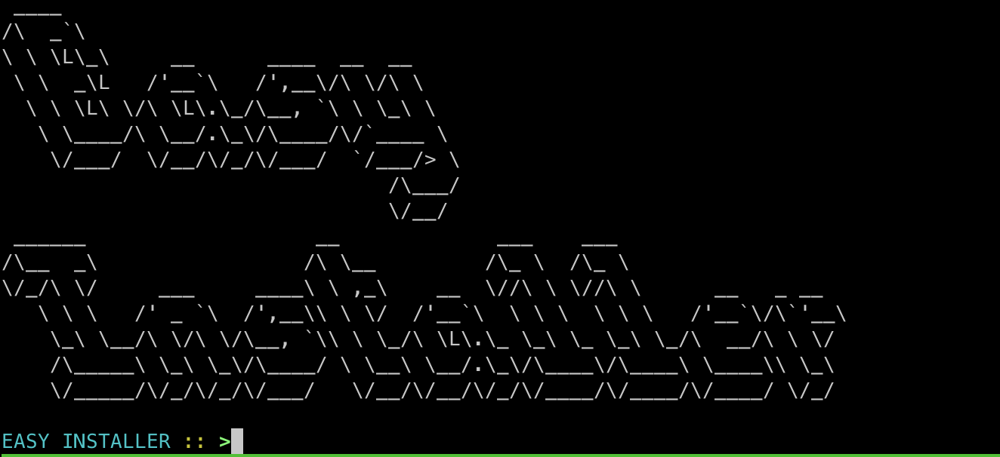
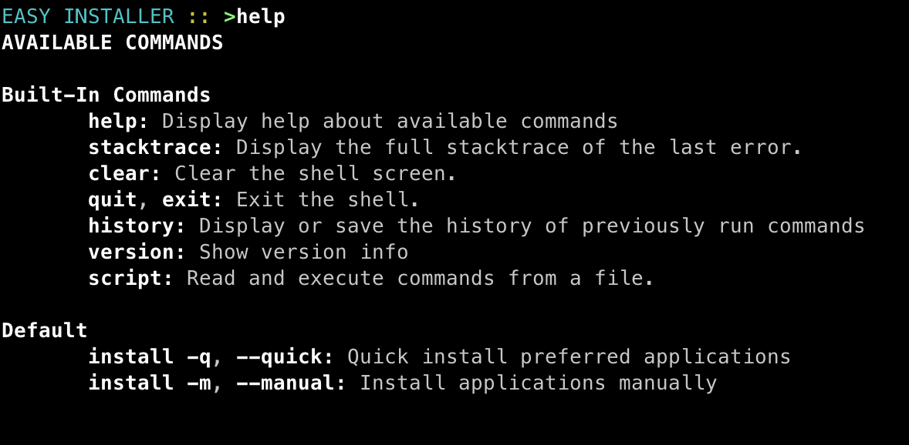
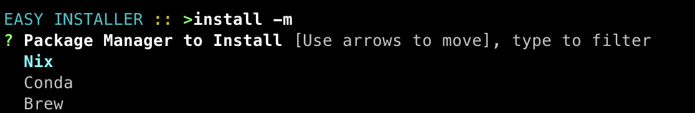

<p align="center">
  
</p>
<p align="center">
    <h1 align="center">EASYINSTALLER</h1>
</p>
<p align="center">
    <em><code>An easy way of installing your favourite applications in one single place</code></em>
</p>
<p align="center">
	
	
	
	
</p>
<p align="center">
	<!-- default option, no dependency badges. -->
</p>

<br>

#####  Table of Contents

- [ Overview](#overview)
- [ Features](#features)
- [ Extensibility](#extensibility)
- [ Repository Structure](#repository-structure)
- [ Getting Started](#getting-started)
    - [ Prerequisites](#prerequisites)
    - [ Installation](#installation)
    - [ Usage](#usage)
    - [ Tests](#tests)
- [ Project Roadmap](#project-roadmap)
- [ Contributing](#contributing)
- [ License](#license)
- [ Acknowledgments](#acknowledgments)

---

##  Overview

Easy Installer is your Go-To application for installing your favourite applications in one single place. 

It is a command-line tool that allows you to install commonly used applications with a single command. It is a Spring Boot application that uses Spring Shell to provide a command-line interface to the user. 
The application is designed to be extensible, so you can easily add new installers to the list of supported applications.



---

##  Features

Easy Installer was designed to extend or even replace the applications offered.

It is also Multi-platform, so you can use it on Windows, MacOS, and Linux.

> [!WARNING] 
> The application is still in its early stages, so some features may not work as expected.

---

## Extensibility 

There's a few entities easily extensible in Easy Installer:

- **Installers**: You can add new installers to the list of supported applications. To do this, you need to create a new class that implements the `InstallableApplication` interface.

    <details closed><summary>src.main.kotlin.com.tomassirio.easyinstaller.service.impl.installer</summary>
    
    | File | Summary |
    | --- | --- |
    | [CondaInstaller.kt](https://github.com/tomassirio/easyinstaller/blob/main/src/main/kotlin/com/tomassirio/easyinstaller/service/impl/installer/CondaInstaller.kt) | <code>❯ REPLACE-ME</code> |
    | [BitwardenCliInstaller.kt](https://github.com/tomassirio/easyinstaller/blob/main/src/main/kotlin/com/tomassirio/easyinstaller/service/impl/installer/BitwardenCliInstaller.kt) | <code>❯ REPLACE-ME</code> |
    | [AlacrittyInstaller.kt](https://github.com/tomassirio/easyinstaller/blob/main/src/main/kotlin/com/tomassirio/easyinstaller/service/impl/installer/AlacrittyInstaller.kt) | <code>❯ REPLACE-ME</code> |
    | [ItermInstaller.kt](https://github.com/tomassirio/easyinstaller/blob/main/src/main/kotlin/com/tomassirio/easyinstaller/service/impl/installer/ItermInstaller.kt) | <code>❯ REPLACE-ME</code> |
    | [AtomInstaller.kt](https://github.com/tomassirio/easyinstaller/blob/main/src/main/kotlin/com/tomassirio/easyinstaller/service/impl/installer/AtomInstaller.kt) | <code>❯ REPLACE-ME</code> |
    | [ScreenInstaller.kt](https://github.com/tomassirio/easyinstaller/blob/main/src/main/kotlin/com/tomassirio/easyinstaller/service/impl/installer/ScreenInstaller.kt) | <code>❯ REPLACE-ME</code> |
    | [GithubCliInstaller.kt](https://github.com/tomassirio/easyinstaller/blob/main/src/main/kotlin/com/tomassirio/easyinstaller/service/impl/installer/GithubCliInstaller.kt) | <code>❯ REPLACE-ME</code> |
    | [AptInstaller.kt](https://github.com/tomassirio/easyinstaller/blob/main/src/main/kotlin/com/tomassirio/easyinstaller/service/impl/installer/AptInstaller.kt) | <code>❯ REPLACE-ME</code> |
    | [PyCharmInstaller.kt](https://github.com/tomassirio/easyinstaller/blob/main/src/main/kotlin/com/tomassirio/easyinstaller/service/impl/installer/PyCharmInstaller.kt) | <code>❯ REPLACE-ME</code> |
    | [GCloudInstaller.kt](https://github.com/tomassirio/easyinstaller/blob/main/src/main/kotlin/com/tomassirio/easyinstaller/service/impl/installer/GCloudInstaller.kt) | <code>❯ REPLACE-ME</code> |
    | [AwsCliInstaller.kt](https://github.com/tomassirio/easyinstaller/blob/main/src/main/kotlin/com/tomassirio/easyinstaller/service/impl/installer/AwsCliInstaller.kt) | <code>❯ REPLACE-ME</code> |
    | [MkDocsInstaller.kt](https://github.com/tomassirio/easyinstaller/blob/main/src/main/kotlin/com/tomassirio/easyinstaller/service/impl/installer/MkDocsInstaller.kt) | <code>❯ REPLACE-ME</code> |
    | [BorgBackupInstaller.kt](https://github.com/tomassirio/easyinstaller/blob/main/src/main/kotlin/com/tomassirio/easyinstaller/service/impl/installer/BorgBackupInstaller.kt) | <code>❯ REPLACE-ME</code> |
    | [DiscordInstaller.kt](https://github.com/tomassirio/easyinstaller/blob/main/src/main/kotlin/com/tomassirio/easyinstaller/service/impl/installer/DiscordInstaller.kt) | <code>❯ REPLACE-ME</code> |
    | [AgeInstaller.kt](https://github.com/tomassirio/easyinstaller/blob/main/src/main/kotlin/com/tomassirio/easyinstaller/service/impl/installer/AgeInstaller.kt) | <code>❯ REPLACE-ME</code> |
    | [EclipseInstaller.kt](https://github.com/tomassirio/easyinstaller/blob/main/src/main/kotlin/com/tomassirio/easyinstaller/service/impl/installer/EclipseInstaller.kt) | <code>❯ REPLACE-ME</code> |
    | [GoInstaller.kt](https://github.com/tomassirio/easyinstaller/blob/main/src/main/kotlin/com/tomassirio/easyinstaller/service/impl/installer/GoInstaller.kt) | <code>❯ REPLACE-ME</code> |
    | [PostgreSqlInstaller.kt](https://github.com/tomassirio/easyinstaller/blob/main/src/main/kotlin/com/tomassirio/easyinstaller/service/impl/installer/PostgreSqlInstaller.kt) | <code>❯ REPLACE-ME</code> |
    | [FishInstaller.kt](https://github.com/tomassirio/easyinstaller/blob/main/src/main/kotlin/com/tomassirio/easyinstaller/service/impl/installer/FishInstaller.kt) | <code>❯ REPLACE-ME</code> |
    | [SynchtingInstaller.kt](https://github.com/tomassirio/easyinstaller/blob/main/src/main/kotlin/com/tomassirio/easyinstaller/service/impl/installer/SynchtingInstaller.kt) | <code>❯ REPLACE-ME</code> |
    | [GitKrakenInstaller.kt](https://github.com/tomassirio/easyinstaller/blob/main/src/main/kotlin/com/tomassirio/easyinstaller/service/impl/installer/GitKrakenInstaller.kt) | <code>❯ REPLACE-ME</code> |
    | [MavenInstaller.kt](https://github.com/tomassirio/easyinstaller/blob/main/src/main/kotlin/com/tomassirio/easyinstaller/service/impl/installer/MavenInstaller.kt) | <code>❯ REPLACE-ME</code> |
    | [RedisInstaller.kt](https://github.com/tomassirio/easyinstaller/blob/main/src/main/kotlin/com/tomassirio/easyinstaller/service/impl/installer/RedisInstaller.kt) | <code>❯ REPLACE-ME</code> |
    | [HttpieInstaller.kt](https://github.com/tomassirio/easyinstaller/blob/main/src/main/kotlin/com/tomassirio/easyinstaller/service/impl/installer/HttpieInstaller.kt) | <code>❯ REPLACE-ME</code> |
    | [MongoDbInstaller.kt](https://github.com/tomassirio/easyinstaller/blob/main/src/main/kotlin/com/tomassirio/easyinstaller/service/impl/installer/MongoDbInstaller.kt) | <code>❯ REPLACE-ME</code> |
    | [SublimeInstaller.kt](https://github.com/tomassirio/easyinstaller/blob/main/src/main/kotlin/com/tomassirio/easyinstaller/service/impl/installer/SublimeInstaller.kt) | <code>❯ REPLACE-ME</code> |
    | [RipGrepInstaller.kt](https://github.com/tomassirio/easyinstaller/blob/main/src/main/kotlin/com/tomassirio/easyinstaller/service/impl/installer/RipGrepInstaller.kt) | <code>❯ REPLACE-ME</code> |
    | [RustInstaller.kt](https://github.com/tomassirio/easyinstaller/blob/main/src/main/kotlin/com/tomassirio/easyinstaller/service/impl/installer/RustInstaller.kt) | <code>❯ REPLACE-ME</code> |
    | [JqInstaller.kt](https://github.com/tomassirio/easyinstaller/blob/main/src/main/kotlin/com/tomassirio/easyinstaller/service/impl/installer/JqInstaller.kt) | <code>❯ REPLACE-ME</code> |
    | [NodeInstaller.kt](https://github.com/tomassirio/easyinstaller/blob/main/src/main/kotlin/com/tomassirio/easyinstaller/service/impl/installer/NodeInstaller.kt) | <code>❯ REPLACE-ME</code> |
    | [KubectlInstaller.kt](https://github.com/tomassirio/easyinstaller/blob/main/src/main/kotlin/com/tomassirio/easyinstaller/service/impl/installer/KubectlInstaller.kt) | <code>❯ REPLACE-ME</code> |
    | [ZoomInstaller.kt](https://github.com/tomassirio/easyinstaller/blob/main/src/main/kotlin/com/tomassirio/easyinstaller/service/impl/installer/ZoomInstaller.kt) | <code>❯ REPLACE-ME</code> |
    | [JenkinsInstaller.kt](https://github.com/tomassirio/easyinstaller/blob/main/src/main/kotlin/com/tomassirio/easyinstaller/service/impl/installer/JenkinsInstaller.kt) | <code>❯ REPLACE-ME</code> |
    | [DjangoInstaller.kt](https://github.com/tomassirio/easyinstaller/blob/main/src/main/kotlin/com/tomassirio/easyinstaller/service/impl/installer/DjangoInstaller.kt) | <code>❯ REPLACE-ME</code> |
    | [HugoInstaller.kt](https://github.com/tomassirio/easyinstaller/blob/main/src/main/kotlin/com/tomassirio/easyinstaller/service/impl/installer/HugoInstaller.kt) | <code>❯ REPLACE-ME</code> |
    | [DockerComposeInstaller.kt](https://github.com/tomassirio/easyinstaller/blob/main/src/main/kotlin/com/tomassirio/easyinstaller/service/impl/installer/DockerComposeInstaller.kt) | <code>❯ REPLACE-ME</code> |
    | [SonarQubeInstaller.kt](https://github.com/tomassirio/easyinstaller/blob/main/src/main/kotlin/com/tomassirio/easyinstaller/service/impl/installer/SonarQubeInstaller.kt) | <code>❯ REPLACE-ME</code> |
    | [AzureCliInstaller.kt](https://github.com/tomassirio/easyinstaller/blob/main/src/main/kotlin/com/tomassirio/easyinstaller/service/impl/installer/AzureCliInstaller.kt) | <code>❯ REPLACE-ME</code> |
    | [MySqlInstaller.kt](https://github.com/tomassirio/easyinstaller/blob/main/src/main/kotlin/com/tomassirio/easyinstaller/service/impl/installer/MySqlInstaller.kt) | <code>❯ REPLACE-ME</code> |
    | [NixInstaller.kt](https://github.com/tomassirio/easyinstaller/blob/main/src/main/kotlin/com/tomassirio/easyinstaller/service/impl/installer/NixInstaller.kt) | <code>❯ REPLACE-ME</code> |
    | [RubyInstaller.kt](https://github.com/tomassirio/easyinstaller/blob/main/src/main/kotlin/com/tomassirio/easyinstaller/service/impl/installer/RubyInstaller.kt) | <code>❯ REPLACE-ME</code> |
    | [VsCodeInstaller.kt](https://github.com/tomassirio/easyinstaller/blob/main/src/main/kotlin/com/tomassirio/easyinstaller/service/impl/installer/VsCodeInstaller.kt) | <code>❯ REPLACE-ME</code> |
    | [BrewInstaller.kt](https://github.com/tomassirio/easyinstaller/blob/main/src/main/kotlin/com/tomassirio/easyinstaller/service/impl/installer/BrewInstaller.kt) | <code>❯ REPLACE-ME</code> |
    | [GpgInstaller.kt](https://github.com/tomassirio/easyinstaller/blob/main/src/main/kotlin/com/tomassirio/easyinstaller/service/impl/installer/GpgInstaller.kt) | <code>❯ REPLACE-ME</code> |
    | [GradleInstaller.kt](https://github.com/tomassirio/easyinstaller/blob/main/src/main/kotlin/com/tomassirio/easyinstaller/service/impl/installer/GradleInstaller.kt) | <code>❯ REPLACE-ME</code> |
    | [DockerInstaller.kt](https://github.com/tomassirio/easyinstaller/blob/main/src/main/kotlin/com/tomassirio/easyinstaller/service/impl/installer/DockerInstaller.kt) | <code>❯ REPLACE-ME</code> |
    | [GitInstaller.kt](https://github.com/tomassirio/easyinstaller/blob/main/src/main/kotlin/com/tomassirio/easyinstaller/service/impl/installer/GitInstaller.kt) | <code>❯ REPLACE-ME</code> |
    | [AgInstaller.kt](https://github.com/tomassirio/easyinstaller/blob/main/src/main/kotlin/com/tomassirio/easyinstaller/service/impl/installer/AgInstaller.kt) | <code>❯ REPLACE-ME</code> |
    | [SdkManagerInstaller.kt](https://github.com/tomassirio/easyinstaller/blob/main/src/main/kotlin/com/tomassirio/easyinstaller/service/impl/installer/SdkManagerInstaller.kt) | <code>❯ REPLACE-ME</code> |
    | [ZshInstaller.kt](https://github.com/tomassirio/easyinstaller/blob/main/src/main/kotlin/com/tomassirio/easyinstaller/service/impl/installer/ZshInstaller.kt) | <code>❯ REPLACE-ME</code> |
    | [FzfInstaller.kt](https://github.com/tomassirio/easyinstaller/blob/main/src/main/kotlin/com/tomassirio/easyinstaller/service/impl/installer/FzfInstaller.kt) | <code>❯ REPLACE-ME</code> |
    | [TerraformInstaller.kt](https://github.com/tomassirio/easyinstaller/blob/main/src/main/kotlin/com/tomassirio/easyinstaller/service/impl/installer/TerraformInstaller.kt) | <code>❯ REPLACE-ME</code> |
    | [PlantumlInstaller.kt](https://github.com/tomassirio/easyinstaller/blob/main/src/main/kotlin/com/tomassirio/easyinstaller/service/impl/installer/PlantumlInstaller.kt) | <code>❯ REPLACE-ME</code> |
    | [PythonInstaller.kt](https://github.com/tomassirio/easyinstaller/blob/main/src/main/kotlin/com/tomassirio/easyinstaller/service/impl/installer/PythonInstaller.kt) | <code>❯ REPLACE-ME</code> |
    | [StarshipInstaller.kt](https://github.com/tomassirio/easyinstaller/blob/main/src/main/kotlin/com/tomassirio/easyinstaller/service/impl/installer/StarshipInstaller.kt) | <code>❯ REPLACE-ME</code> |
    | [TmuxInstaller.kt](https://github.com/tomassirio/easyinstaller/blob/main/src/main/kotlin/com/tomassirio/easyinstaller/service/impl/installer/TmuxInstaller.kt) | <code>❯ REPLACE-ME</code> |
    
    </details>

- **Strategies**: You can add new strategies to the list of supported package managers. To do this, you need to create a new class that implements the `DownloadStrategy` interface.

    <details closed><summary>src.main.kotlin.com.tomassirio.easyinstaller.service.impl.installer.strategy</summary>
    
    | File | Summary |
    | --- | --- |
    | [AptStrategy.kt](https://github.com/tomassirio/easyinstaller/blob/main/src/main/kotlin/com/tomassirio/easyinstaller/service/impl/installer/strategy/AptStrategy.kt) | <code>❯ REPLACE-ME</code> |
    | [BaseStrategy.kt](https://github.com/tomassirio/easyinstaller/blob/main/src/main/kotlin/com/tomassirio/easyinstaller/service/impl/installer/strategy/BaseStrategy.kt) | <code>❯ REPLACE-ME</code> |
    | [DownloadStrategy.kt](https://github.com/tomassirio/easyinstaller/blob/main/src/main/kotlin/com/tomassirio/easyinstaller/service/impl/installer/strategy/DownloadStrategy.kt) | <code>❯ REPLACE-ME</code> |
    | [DefaultStrategy.kt](https://github.com/tomassirio/easyinstaller/blob/main/src/main/kotlin/com/tomassirio/easyinstaller/service/impl/installer/strategy/DefaultStrategy.kt) | <code>❯ REPLACE-ME</code> |
    | [DownloadStrategyContext.kt](https://github.com/tomassirio/easyinstaller/blob/main/src/main/kotlin/com/tomassirio/easyinstaller/service/impl/installer/strategy/DownloadStrategyContext.kt) | <code>❯ REPLACE-ME</code> |
    | [BrewStrategy.kt](https://github.com/tomassirio/easyinstaller/blob/main/src/main/kotlin/com/tomassirio/easyinstaller/service/impl/installer/strategy/BrewStrategy.kt) | <code>❯ REPLACE-ME</code> |
    
    </details>

- **Commands**: You can add new commands to the list of supported commands. To do this, you can create a new Command in the InstallerCommand or add new features using SpringShell

    <details closed><summary>src.main.kotlin.com.tomassirio.easyinstaller.command</summary>
    
    | File | Summary |
    | --- | --- |
    | [InstallerCommand.kt](https://github.com/tomassirio/easyinstaller/blob/main/src/main/kotlin/com/tomassirio/easyinstaller/command/InstallerCommand.kt) | <code>❯ REPLACE-ME</code> |
    
    </details>

- **Steps**: Additionally, if you want to add a new category to the installation processes, you can add a new Step

    <details closed><summary>src.main.kotlin.com.tomassirio.easyinstaller.command.step</summary>
    
    | File | Summary |
    | --- | --- |
    | [DatabaseToolStep.kt](https://github.com/tomassirio/easyinstaller/blob/main/src/main/kotlin/com/tomassirio/easyinstaller/command/step/DatabaseToolStep.kt) | <code>❯ REPLACE-ME</code> |
    | [PackageManagerStep.kt](https://github.com/tomassirio/easyinstaller/blob/main/src/main/kotlin/com/tomassirio/easyinstaller/command/step/PackageManagerStep.kt) | <code>❯ REPLACE-ME</code> |
    | [SecurityToolStep.kt](https://github.com/tomassirio/easyinstaller/blob/main/src/main/kotlin/com/tomassirio/easyinstaller/command/step/SecurityToolStep.kt) | <code>❯ REPLACE-ME</code> |
    | [CommandLineToolStep.kt](https://github.com/tomassirio/easyinstaller/blob/main/src/main/kotlin/com/tomassirio/easyinstaller/command/step/CommandLineToolStep.kt) | <code>❯ REPLACE-ME</code> |
    | [BaseStep.kt](https://github.com/tomassirio/easyinstaller/blob/main/src/main/kotlin/com/tomassirio/easyinstaller/command/step/BaseStep.kt) | <code>❯ REPLACE-ME</code> |
    | [BuildAndCiCdToolStep.kt](https://github.com/tomassirio/easyinstaller/blob/main/src/main/kotlin/com/tomassirio/easyinstaller/command/step/BuildAndCiCdToolStep.kt) | <code>❯ REPLACE-ME</code> |
    | [BackupSyncToolStep.kt](https://github.com/tomassirio/easyinstaller/blob/main/src/main/kotlin/com/tomassirio/easyinstaller/command/step/BackupSyncToolStep.kt) | <code>❯ REPLACE-ME</code> |
    | [VersionControlSystemStep.kt](https://github.com/tomassirio/easyinstaller/blob/main/src/main/kotlin/com/tomassirio/easyinstaller/command/step/VersionControlSystemStep.kt) | <code>❯ REPLACE-ME</code> |
    | [CommunicationToolStep.kt](https://github.com/tomassirio/easyinstaller/blob/main/src/main/kotlin/com/tomassirio/easyinstaller/command/step/CommunicationToolStep.kt) | <code>❯ REPLACE-ME</code> |
    | [InstallationStep.kt](https://github.com/tomassirio/easyinstaller/blob/main/src/main/kotlin/com/tomassirio/easyinstaller/command/step/InstallationStep.kt) | <code>❯ REPLACE-ME</code> |
    | [ContainerAndVirtualizationToolStep.kt](https://github.com/tomassirio/easyinstaller/blob/main/src/main/kotlin/com/tomassirio/easyinstaller/command/step/ContainerAndVirtualizationToolStep.kt) | <code>❯ REPLACE-ME</code> |
    | [ProgrammingLanguageToolStep.kt](https://github.com/tomassirio/easyinstaller/blob/main/src/main/kotlin/com/tomassirio/easyinstaller/command/step/ProgrammingLanguageToolStep.kt) | <code>❯ REPLACE-ME</code> |
    | [DocumentationToolStep.kt](https://github.com/tomassirio/easyinstaller/blob/main/src/main/kotlin/com/tomassirio/easyinstaller/command/step/DocumentationToolStep.kt) | <code>❯ REPLACE-ME</code> |
    | [ShellAndTerminalManagerStep.kt](https://github.com/tomassirio/easyinstaller/blob/main/src/main/kotlin/com/tomassirio/easyinstaller/command/step/ShellAndTerminalManagerStep.kt) | <code>❯ REPLACE-ME</code> |
    | [CloudCliToolStep.kt](https://github.com/tomassirio/easyinstaller/blob/main/src/main/kotlin/com/tomassirio/easyinstaller/command/step/CloudCliToolStep.kt) | <code>❯ REPLACE-ME</code> |
    
    </details>
  
- **Annotations**: To simplify the implementation of a Step, you can tag your installers with annotations to their corresponding step, or you can create a new one.

    <details closed><summary>src.main.kotlin.com.tomassirio.easyinstaller.service.annotation</summary>
    
    | File | Summary |
    | --- | --- |
    | [ProgrammingLanguageTool.kt](https://github.com/tomassirio/easyinstaller/blob/main/src/main/kotlin/com/tomassirio/easyinstaller/service/annotation/ProgrammingLanguageTool.kt) | <code>❯ REPLACE-ME</code> |
    | [DatabaseTool.kt](https://github.com/tomassirio/easyinstaller/blob/main/src/main/kotlin/com/tomassirio/easyinstaller/service/annotation/DatabaseTool.kt) | <code>❯ REPLACE-ME</code> |
    | [PackageManager.kt](https://github.com/tomassirio/easyinstaller/blob/main/src/main/kotlin/com/tomassirio/easyinstaller/service/annotation/PackageManager.kt) | <code>❯ REPLACE-ME</code> |
    | [ContainerAndVirtualizationTool.kt](https://github.com/tomassirio/easyinstaller/blob/main/src/main/kotlin/com/tomassirio/easyinstaller/service/annotation/ContainerAndVirtualizationTool.kt) | <code>❯ REPLACE-ME</code> |
    | [IdesAndTextEditor.kt](https://github.com/tomassirio/easyinstaller/blob/main/src/main/kotlin/com/tomassirio/easyinstaller/service/annotation/IdesAndTextEditor.kt) | <code>❯ REPLACE-ME</code> |
    | [SecurityTool.kt](https://github.com/tomassirio/easyinstaller/blob/main/src/main/kotlin/com/tomassirio/easyinstaller/service/annotation/SecurityTool.kt) | <code>❯ REPLACE-ME</code> |
    | [CloudCLITool.kt](https://github.com/tomassirio/easyinstaller/blob/main/src/main/kotlin/com/tomassirio/easyinstaller/service/annotation/CloudCLITool.kt) | <code>❯ REPLACE-ME</code> |
    | [CommunicationTool.kt](https://github.com/tomassirio/easyinstaller/blob/main/src/main/kotlin/com/tomassirio/easyinstaller/service/annotation/CommunicationTool.kt) | <code>❯ REPLACE-ME</code> |
    | [CommandLineTool.kt](https://github.com/tomassirio/easyinstaller/blob/main/src/main/kotlin/com/tomassirio/easyinstaller/service/annotation/CommandLineTool.kt) | <code>❯ REPLACE-ME</code> |
    | [ShellAndTerminalManager.kt](https://github.com/tomassirio/easyinstaller/blob/main/src/main/kotlin/com/tomassirio/easyinstaller/service/annotation/ShellAndTerminalManager.kt) | <code>❯ REPLACE-ME</code> |
    | [BuildAndCiCdTool.kt](https://github.com/tomassirio/easyinstaller/blob/main/src/main/kotlin/com/tomassirio/easyinstaller/service/annotation/BuildAndCiCdTool.kt) | <code>❯ REPLACE-ME</code> |
    | [VersionControlSystem.kt](https://github.com/tomassirio/easyinstaller/blob/main/src/main/kotlin/com/tomassirio/easyinstaller/service/annotation/VersionControlSystem.kt) | <code>❯ REPLACE-ME</code> |
    | [DocumentationTool.kt](https://github.com/tomassirio/easyinstaller/blob/main/src/main/kotlin/com/tomassirio/easyinstaller/service/annotation/DocumentationTool.kt) | <code>❯ REPLACE-ME</code> |
    | [BackupSyncTool.kt](https://github.com/tomassirio/easyinstaller/blob/main/src/main/kotlin/com/tomassirio/easyinstaller/service/annotation/BackupSyncTool.kt) | <code>❯ REPLACE-ME</code> |
    
    </details>

> [!IMPORTANT]  
> This application also implements a Default Installer in case you pick no package manager. You can find the URLs for the default installers in the application.properties file.
> This feature is purely experimental at the moment as it is complicated to implement for many OSs

##  Repository Structure

```sh
└── easyinstaller/
    ├── mvnw
    ├── mvnw.cmd
    ├── pom.xml
    └── src
        ├── main
        │   ├── kotlin
        │   │   └── com.tomassirio.easyinstaller
        │   │       ├── command
        │   │       │   ├── step   
        │   │       │   └── InstallerCommand.kt
        │   │       ├── service
        │   │       │   ├── annotation
        │   │       │   ├── impl
        │   │       │   │   ├── installer
        │   │       │   │   │   ├── strategy
        ├── test
        └── resources
            └── application.properties
       
```

---

##  Getting Started

###  Prerequisites

**Kotlin**: `version 1.9.24`

###  Installation

Build the project from source:

1. Clone the easyinstaller repository:
```sh
❯ git clone https://github.com/tomassirio/easyinstaller
```

2. Navigate to the project directory:
```sh
❯ cd easyinstaller
```

3. Install the required dependencies:
```sh
❯ ./mvnw clean install
```

###  Usage

To run the project, execute the following command:

```sh
❯ java -jar target/EasyInstaller-0.1.0.jar  
```

###  Tests

Execute the test suite using the following command:

```sh
❯ ./mvnw clean verify
```

> [!TIP]
> You can use the help command to get all the available commands and their descriptions.



> [!NOTE]
> So far the application implements a quick install and a manual one (The manual one was the one I invested the most time on)



---

##  Project Roadmap

- [X] **`Task 1`**: <strike>Implement installers and test them</strike>
- [X] **`Task 2`**: <strike>Add Documentation</strike>.
- [ ] **`Task 3`**: Welcome Hacktoberfest new Joiners!.

---

##  Contributing

Contributions are welcome! Specially if you are here for Hacktoberfest 2024! 

Here are several ways you can contribute:

- **[Report Issues](https://github.com/tomassirio/easyinstaller/issues)**: Submit bugs found or log feature requests for the `easyinstaller` project.
- **[Submit Pull Requests](https://github.com/tomassirio/easyinstaller/blob/main/CONTRIBUTING.md)**: Review open PRs, and submit your own PRs.
- **[Join the Discussions](https://github.com/tomassirio/easyinstaller/discussions)**: Share your insights, provide feedback, or ask questions.

<details closed>
<summary>Contributing Guidelines</summary>

1. **Fork the Repository**: Start by forking the project repository to your github account.
2. **Clone Locally**: Clone the forked repository to your local machine using a git client.
   ```sh
   git clone https://github.com/tomassirio/easyinstaller
   ```
3. **Create a New Branch**: Always work on a new branch, giving it a descriptive name.
   ```sh
   git checkout -b new-feature-x
   ```
4. **Make Your Changes**: Develop and test your changes locally.
5. **Commit Your Changes**: Commit with a clear message describing your updates.
   ```sh
   git commit -m 'Implemented new feature x.'
   ```
6. **Push to github**: Push the changes to your forked repository.
   ```sh
   git push origin new-feature-x
   ```
7. **Submit a Pull Request**: Create a PR against the original project repository. Clearly describe the changes and their motivations.
8. **Review**: Once your PR is reviewed and approved, it will be merged into the main branch. Congratulations on your contribution!
</details>

<details closed>
<summary>Contributor Graph</summary>
<br>
<p align="left">
   <a href="https://github.com{/tomassirio/easyinstaller/}graphs/contributors">
      
   </a>
</p>
</details>

---

##  Acknowledgments

- List any resources, contributors, inspiration, etc. here.

---
